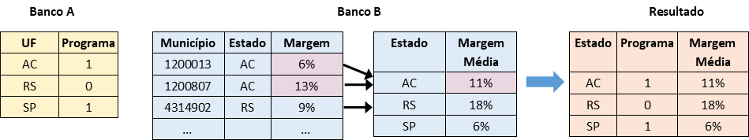
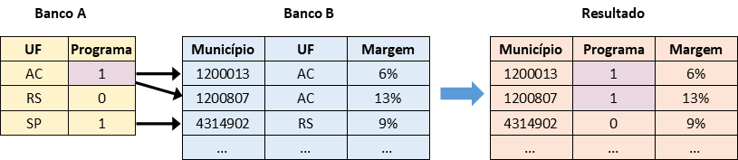

<style>
div.green { background-color:#e5f5e0; border-radius: 5px; padding: 20px;}
</style>

<style>
div.orange { background-color:#fee6ce; border-radius: 5px; padding: 20px;}
</style>

<style>
div.blue { background-color:#deebf7; border-radius: 5px; padding: 20px;}
</style>

<style>
div.purple { background-color:#9e9ac8; border-radius: 5px; padding: 20px;}
</style>


```{r setup, include=FALSE, echo=F}
knitr::opts_chunk$set(echo = T, eval=T, highlight=T)
library("nycflights13")
library("tidyverse")
library("rmarkdown")
library("knitr")
library("kableExtra")
```

# Unidades de Análise

A maioria de projetos exigem a combinação de dados de fontes diversas. É assim que criamos a nossa própria contribuição para a pesquisa. Por exemplo, para estudar o efeito de um programa de governo sobre a votação, preciseramos de pelo menos dois bancos de dados, um com os dados da localização do programa e outro sobre os resultados eleitorais. Como podemos juntar estes dois bancos para facilitar a nossa análise?

Primeiro, temos que entender os dois bancos: (i) qual é a unidade de análise de cada observaçao? e (ii) quais são as variáveis chaves em cada banco que identificam unicamente cada observação (evitando duplicações)? 

No exemplo acima, pode ser que o programa do governo foi executado em alguns municípios e não em outros, então o nosso banco varia por município, identificado unicamente com a variável do código municipal do IBGE. Por outro lado, imagine que temos os dados eleitorais apenas dos prefeitos e queremos avaliar a margem de vitória, então a unidade de análise é cada município, identificado pelo código municipal do IBGE também.

Quando os nossos dois bancos têm a mesma unidade de análise e as mesmas variáveis, a junção dos bancos é mais ou menos fácil. Usamos as variáveis de identificador único e identico para adicionar as colunas de um banco para o outro.


Isto é a circunstância mais fácil e trivial para cruzar os dois bancos: a mesma unidade de análise, um identificador único e ígual em cada banco, e dados completos.

## Unidades Diferentes

Imagine agora que o banco de dados do programa do governo varia por *estado* em vez do município, então ele tem apenas 27 observações, identificadas por sigla do estado ("AC" etc.). Neste caso em que a unidade de análise e as variáveis variam entre bancos, como é possível juntar os bancos? É essencial que os dois bancos têm a mesma unidade de análise. Primeiro, temos que decidir a unidade de análise desejada do banco de dados final - por estado ou por município? As duas são possíveis. 

**Estratégia 1: Agregando o banco com mais unidades:** Se quissemos uma tabela final por estado, temos que *agregar* os dados eleitorais do nível municipal para o nível estadual com as ferramentas já conhecidas (`%>% group_by() %>% summarize()`). Isto exige uma decisão sobre como a agregar cada variável municipal para o estadual - a média, a mediana, o mínimo etc. Com os dois bancos no nível estadual, é fácil executar a junção, e o resultado será um banco de dados com dados eleitorais e do programa por cada estado.



**Estratégia 2: Duplicando os dados do banco com menos unidades:** Se quissemos uma tabela final por município, não precisa muita preparação mas temos que reconhecer que juntando os dois bancos vai *duplicar* os dados estaduais para cada município no estado. Por exemplo, a presença do programa indicado por código '1' em "AC" será reptido para cada município de Acre. Isto faz sentido neste contexto, mas é crucial entender o que está acontecendo.



Porém, existe uma outra dificuldade com qualquer uma das duas estratégias - o identificador único de estados ("AC") não é ígual ao identificador único dos municípios ("1200013"). Como o R vai saber como a cruzar observações de um banco com o outro? Ele precisa saber em qual estado fica cada município. Nós tivemos que adicionar uma nova coluna do estado no Banco eleitoral (Banco B) para facilitar o cruzamento. 

A informação do estado está presente no código de município, e podemos criar o identificador se conhecemos bem os nossos dados, mas o trabalho para tornar os identificadores identicos é o nosso: Temos que separar os primeiros dois dígitos do código municipal que indicam o estado, e depois mapear os dígitos para a sigla. O resultado será uma nova variável, a sigla do estado, para cada município. Agora, temos a sigla do estado no mesmo formato nos dois banco de dados e eles são compatíveis para cruzar. Apenas no final dessa preparação é possível juntar os dois bancos. 

# Exemplos de Joins Simples (`left_join`)

Até agora, só discutimos os passos preparatórios:  
(1) Decidir a unidade de análise de banco de dados final,  
(2) Agregar os bancos de dados iniciais para a unidade de análise desejado se necessário,  
(3) Transformar as variáveis para que temos um identificador comum entre os banco de dados.

O próximo passo é juntar os dois bancos. Vamos usar a função `left_join()`. Temos que definir três argumentos: Os nomes dos dois bancos de dados, e o conjunto de variáveis (a 'chave') que usaremos para realizar a junção. O R vai combinar todas as observações com o mesmo valor de variável chave nos dois bancos e insira-o com uma linha na nova tabela.

Sempre começamos com o banco de dados que já tem a unidade de análise e número de linhas desejados no banco de dados final, e encaminhamos este banco para a função `left_join()`. Dentro de `left_join` especificamos o segundo banco de dados, e a variável chave (num vetor se for mais que uma variável).

```{r, eval=F}
Banco_1 %>% left_join(Banco_2, "Identificador Comum")
```

Para praticar, vamos abrir um outro banco do conjunto de dados no pacote `nycflights13`, sobre os aviões mesmo, `planes`. A unidade de `flights` é um voo (uma partida de Nova Iorque) e à unidade de `planes` é um avião, repetida várias vezes em `flights`. A variável de identificar comum é `tailnum`, que é exclusivo para cada avião. 

Para ver um exemplo em que a unidade de análise é basicamente ígual - cada avião faz uma viagem só - vamos filtrar os voos para um dia e trajeto específico. 

```{r, eval=F}
flights_JFK_ATL <- flights %>% filter(month==4 & day==22 & origin=="JFK" & dest=="ATL")
```

```{r, echo=F}
flights_JFK_ATL <- flights %>% filter(month==4 & day==22 & origin=="JFK" & dest=="ATL")

flights_JFK_ATL %>%
  paged_table()
```

Pode verificar que os aviões (o `tailnum`) só aparece uma vez na tabela acima. Agora, é fácil cruzar os duas tabelas com o identificador único e comum:

```{r, eval=F}
flights_JFK_ATL %>% left_join(planes, by="tailnum")
```

```{r, echo=F}
flights_JFK_ATL %>% left_join(planes, by="tailnum") %>% paged_table()
```

Explore a tabela. O resultado é como previsto: uma linha para cada voo, com os dados da avião nas colunas mais para a direita. Simples. 

Mais geralmente, se nós não filtramos os voos anteriormente e temos aviões duplicados, temos que planejar com mais cuidado: Qual unidade de análise queremos na tabela final? Uma linha por voo, ou uma linha por avião?

**Estratégia 1: Agregando o banco com mais unidades:** Uma opção é por avião, resumindo por exemplo o número de viagens de cada avião, que exige uma agregação de banco `flights` por `tailnum`:

```{r}
flights_por_aviao <- flights %>% 
  group_by(tailnum) %>%
  tally()
```

Observe que `flights_por_aviao` tem muito menos observações que `flights`, e a unidade de análise é cada avião, compatível com a unidade da tabela `planes`. Agora ,a junção é fácil:

```{r}
planes_com_num_viagens <- planes %>% left_join(flights_por_aviao, by="tailnum")
```

```{r, echo=F}
planes_com_num_viagens %>% paged_table()
```

Como aparece o resultado final? O `planes` agora tem mais uma coluna com o número de viagens de cada avião - poderoso, né? Note que o número de linhas no resultado é ígual ao número de linhas no banco de `planes`.

**Estratégia 2: Duplicando os dados do banco com menos unidades:** A outra opção é gerar um novo tibble com cada observação um voo, e adicionando dados da avião ao tabela de `flights`. Dado que temos múltiplos voos para cada avião isso implica uma duplicação dos dados de avião cada vez que ele aparece no banco `flights`. 

```{r}
flights_com_planes <- flights %>% left_join(planes, by="tailnum")
```

Observe que `flights_com_planes` tem o mesmo número de linhas que `flights`. Vamos filtrar e ordenar os nossos dados para ver que os dados do avião são repetidas cada vez que o avião fez uma viagem:

```{r, eval=F}
flights_com_planes %>% 
  filter(dest=="GSO") %>% 
  arrange(tailnum) %>%
  select(tailnum, month, day, dep_time, manufacturer, year.y, model, seats)
```

```{r, echo=F}
flights_com_planes %>% 
  filter(dest=="GSO") %>% 
  arrange(tailnum) %>%
  select(tailnum, month, day, dep_time, manufacturer, year.y, model, seats) %>%
  paged_table()
```

Observe que geramos um problema pequeno quando juntamos os dois bancos: ambos os bancos originais contém uma variável se chama 'year'. Dado que as variáveis têm que ter nomes únicos, o R renomeou as colunas 'year.x' e 'year.y'. Isto é um pouco chato porque realmente não distingue informação diferente: o ano da viagem (year.x) e o ano da fabricação do voo (year.y). É sempre melhor renomear as variáveis *antes* da junção para evitar conflitos e descrever melhor as nossas variáveis, ou selecionar apenas as variáveis que você quer transportar de um banco de dados para o outro.

```{r}
planes <- planes %>%
  rename("year_fabricação"="year")

flights_com_planes <- flights %>% left_join(planes, by="tailnum")
```

Agora, o nosso novo tibble é pronto para analisar e visualizar como qualquer outro tibble que já vimos. Por exemplo, vamos resumir o número de voos por ano de fabricaçao da avião:

```{r}
flights_com_planes %>% 
  group_by(year_fabricação) %>%
  tally() %>%
  ggplot() +
  geom_col(aes(x=year_fabricação, y=n))
```

Espero que você não estava num voo com avião da década 50...

### Identificando Observações Faltantes

Até agora, assumimos que os dois bancos contém dados completos: que cada avião que existe no banco de dados `flights` existe no banco de dados `planes` (não estamos faltando dados), e que cada avião no banco de dados `planes` existe no banco de dados `flights` (não temos aviões adicionais que não voaram). Isso é importante para verificar se a junção deu certo.

A função útil para identificar as observações que existem em um banco mas não um outro é `anti_join`. Ela segue exatamente o mesmo padrão que `left_join()`, mas o resultado não é um tibble combinado, é as observações do primeiro tibble que não aparecem no segundo.

```{r, eval=F}
flights %>% anti_join(planes, by="tailnum")
```

```{r, echo=F}
flights %>% anti_join(planes, by="tailnum")  %>%
  paged_table()
```

Observe que temos 52,606 observações em `flights` que têm um `tailnum` que não existe em `planes`. Isso afeta, por exemplo, o nosso gráfico por ano de fabricação do voo, que falta estes voos. Pode ser crucial entender este viés para a sua análise.

Também é fácil availiar o inverso: se existam aviões que não voaram da Nova Iorque em 2013, invertindo os dois bancos de dados no `anti_join()`. 

```{r, eval=F}
planes %>% anti_join(flights, by="tailnum") 
```

```{r, echo=F}
planes %>% anti_join(flights, by="tailnum")  %>%
  paged_table()
```

Boa notícia: todas as aviões de `planes` são presentes em `flights`. 

<div class = "green">
# Exercício 1: Juntando dois bancos

```{r codefolder1, echo=FALSE, results='asis'}
codefolder::distill(init = "show")
```

1. Crie dois tibbles pequenos (com a função `tibble()`) como eles abaixo e juntar eles pela coluna `ID`. 

```{r, echo=T}
t1 <- tibble(ID=c("A001","A002","A003"),
             Valor=c(10,20,50)) %>% paged_table()
t2 <- tibble(ID=c("A001","A002","A003"),
             População=c(3000, 2500, 6000)) %>% paged_table()

```

```{r, echo=F}
t1
t2
```

```{r, echo=T}
t_combined <- t1 %>% left_join(t2, by="ID")
```

2. Execute um join dos bancos de dados `flights` e `planes` para apenas os voos de `carrier` United (UA) no dia 16 de setembro de 2013. Qual é o modelo (`model`) de avião mais comum destes voos?

```{r, echo=T, eval=F}
flights_specific <- flights %>% 
  filter(month==9 & day==16 & year==2013 & carrier=="UA")

flights_specific_planes <- flights_specific %>% 
  left_join(planes, by="tailnum")

flights_specific_planes %>% group_by(model) %>% 
  tally() %>% 
  top_n(1, n)
```

3. Quantos assentos (`seats`) totais foram instalados nos voos de JFK para Atlanta (ATL) em cada mês?

```{r, echo=T, eval=F}
flights %>% left_join(planes, by="tailnum") %>%
  filter(origin=="JFK" & dest=="ATL") %>%
  group_by(month) %>%
  summarize(total_assentos=sum(seats, na.rm=T))
```

4. Queremos um resumo do número de voos no ano de 2013 por companhia aérea. Mas o nosso banco de `flights` não contém o nome oficial das companhias. Execute um join entre o banco de dados `flights` e `airlines` para criar uma tabela resumida e clara.

```{r, echo=T, eval=F}
flights %>% group_by(carrier) %>% 
  tally() %>%
  left_join(airlines, by="carrier") %>%
  select(name, n)
```

</div>

# Juntando Bancos por Múltiplas Variáveis

Considere um outro banco de dados no pacote `nycflights13`, `weather`, que contém as condições climáticas em cada aeroporto por hora. Como sabemos o tempo para cada voo? Não é suficiente juntar por 'origin', obviamente porque o tempo varia por dia e hora e queremos as condições relevantes na hora da partida do voo. Então é necessário juntar com as variáveis que identificam a unidade de análise comum entre os dois bancos: localização e hora. 

Localização é fácil: 'origin'. Hora é mais complexo: para definir o momento exato temos que considerar 'year', 'month', 'day' e 'hour'. Idealmente queremos incluir 'minute' também que existe no banco `flights`,  mas está faltando no banco de `weather`, então não é possível. Para incluir todas essas variáveis como identificadores comuns, é só incluir eles no argumento do `left_join`, usando um vector (`c()`) para designar todas as variáveis relevantes:

```{r}
flights_weather <- flights %>% left_join(weather, c("origin", "year", "month", "day", "hour"))
```

Como fica o resultado? Ele tem o mesmo número de linhas que `flights` e mais dez colunas para as condições clímaticas na hora e local correspondente.

Por interesse, podemos identificar os voos sujeitos a maior velocidade de vento:

```{r, eval=F}
flights_weather %>% ungroup() %>% 
  top_n(1, wind_speed)
```

```{r, echo=F}
flights_weather %>% ungroup() %>% 
  top_n(1, wind_speed) %>%
  paged_table()
```

O que acontece se esquecemos de um identificador comum relevante? Por exemplo, sem 'origin'?

```{r, eval=F}
flights %>% left_join(weather, c("year", "month", "day", "hour"))
```

Opa, o nosso banco agora tem mais de uma milhão de linhas! Por que? Lembre-se que com um `left_join` começamos com o banco na esquerda e, para cada voo, buscamos as linhas no segundo banco (`weather`) com o mesmo year, month, day e hour. Por exemplo, o primeiro voo no banco de dados `flights` partiu a hora:

```{r, eval=F}
flights %>% slice(1) %>% select(year, month, day, hour)
```

```{r, echo=F}
flights %>% slice(1) %>% select(year, month, day, hour) %>% paged_table()
```

Quantas observações no banco de dados de `weather` batem com estes critérios? Vamos ver:

```{r, eval=F}
weather %>% filter(year==2013 & month==1 & day==1 & hour==5)
```

```{r, echo=F}
weather %>% filter(year==2013 & month==1 & day==1 & hour==5) %>%
  paged_table()
```

Três. Uma para cada aeroporto de origem, que esquecemos de incluir como identificador comum. Então quando pedimos para R juntar os dois bancos apenas pelas variáveis de year, month, day e hour, adicionamos três observações de tempo para *cada* voo, triplicando o tamanho de banco de dados. O resultado é que cada os dados do voo é duplicado três vezes, cada um com dados diferentes de tempo, como mostrado na tabela abaixo. Duas das linhas são erradas porque são os dados de tempo de locais diferentes.

```{r, eval=F}
flights %>% left_join(weather, c("year", "month", "day", "hour")) %>% 
  slice(1:3) %>%
  select(year, month, day, hour, dep_time, carrier, flight, humid, wind_speed)
```

```{r, echo=F}
flights %>% left_join(weather, c("year", "month", "day", "hour")) %>% 
  slice(1:3) %>%
  select(year, month, day, hour, dep_time, carrier, flight, humid, wind_speed) %>%
  paged_table()
```

A conclusão é simples: sempre inclua todas as variáveis que são identificadores comuns nos dois bancos de dados. Se a `left_join()` aumenta o número de linhas entre o seu primeiro banco e o resultado, isto significa que existe mais de uma observação no segundo banco com os mesmos valores de variáveis identificadores. É possível que você deseja este resultado, mais incomum, então presta atenção. 

# Bancos e Dados Faltantes (`right_join`, `inner_join`, `full_join`, `anti_join`)

A característica mais importante da função `left_join()` é que ela tenta ao máximo possível para preservar a unidade de análise e número de linhas do primeiro banco (o banco que encaminhamos antes do pipe). Assim, não podemos 'perder' observações por causa da junção, e se especificamos os identificadores comuns corretamente, não devemos acrescentar observações também.

Porém, o resultado é um banco de dados com dados faltantes - `NA` - para cada observação que não tinha um par no segundo banco de dados. Por exemplo, `flights_com_planes` cruzou os dados de voos com aqueles dos aviões, mas alguns valores de `tailnum` no banco de dados de `flights` não existiam no banco de dados `planes`. Por exemplo, veja quentos aviões não são conhecidos entre LGA e ORD:

```{r, eval=F}
flights_com_planes %>% filter(origin=="LGA" & dest=="ORD") %>%
  select(month, day, dep_time, type, model, seats)
```

```{r, echo=F}
flights_com_planes %>% filter(origin=="LGA" & dest=="ORD") %>%
  select(month, day, dep_time, type, model, seats) %>%
  paged_table()
```

Que tal se quisemos um banco de dados mais 'limpo' no resultado da junção dos dois tibbles, tirando as observações que não tem um par no outro banco? As vezes é útil e eficiente usar a função alternativa `inner_join()`. Ela funciona identicalmente que `left_join()` exceto que o resultado falta as observações para quais o identificador comum não existe nos dois bancos:

```{r, eval=F}
flights %>% inner_join(planes, by=c("tailnum"))
```

Quantas observações existem no resultado? `r nrow(flights %>% inner_join(planes, by=c("tailnum")))`, a diferença entre o número de observações em `flights` (`r nrow(flights)`) e os voos sem `tailnum` em `planes`, o resultado de `anti_join` (`r nrow(flights %>% anti_join(planes, by=c("tailnum")))`); pode verificar. 

Frequentemente, usando um `inner_join` gera um viés de seleção - não sabemos muito sobre as aviões faltandas, mas não podemos ignorar eles para uma análise quantitativa. Então sempre recomendamos um `left_join()` como a ferramenta padrão.

Para mostrar situações mais complexas, vamos trabalhar com um outro banco de dados de `nycflights13`, os dados de `airports`, que contém o seu nome completo, localização etc. O primeiro desafio aqui é que temos que decidir como a juntar os bancos? No `flights` temos duas colunas sobre aeroportos: `origin` e `dest`. Lembrando que `origin` é só os três aeroportos de Nova Iorque, juntando por `origin` vai gerar muita repetição. Então vamos importar os dados do aeroporto do destino, `dest`. 

O identificador único do tibble `airports` é `faa`, que usa o mesmo código official que `dest`, que é ótimo. Porém, os nomes de colunas são diferentes nos dois bancos: `dest` e `faa`. Como resolvemos a diferença? Há várias possibilidades, mas sugerimos renomear a coluna de um banco antes de executar a junção para evitar problemas. Dado que as variáveis refletem exatamente o mesmo conteúdo, faz sentido que eles teriam nome ígual:

```{r, eval=F}
airports <- airports %>% 
  rename(dest=faa)

flights %>% left_join(airports, by=c("dest"))
```

```{r, echo=F}
airports <- airports %>% 
  rename(dest=faa)

flights %>% left_join(airports, by=c("dest")) %>% paged_table()
```

Outro ponto para reconhecer é que adicionamos muitas novas colunas de `airports` ao `flights` que pode poluir a nossa análise/apresentação. As vezes é melhor selecionar as colunas no segundo banco antes de realizar a junção. Por exemplo, se apenas quisemos o nome completo do aeroporto:

```{r, eval=F}
flights %>% left_join(airports %>% select(dest, name), 
                      by=c("dest"))
```

Voltando a questão de dados faltantes, há mais uma maneira em que os `airports` são difíceis para juntar: Em contraste com os dados de `planes`, `airports` inclui aeroportos que não foram destinos dos voos de `flights`. Então ambos os `anti_join`s mostram observações faltantes:

```{r, eval=F}
flights %>% anti_join(airports, by=c("dest"))
airports %>% anti_join(flights, by=c("dest"))
```

Lembre-se que o nosso `left_join` preservou todos os dados de `flights` e incorporou (como colunas novas) os dados de apenas os aeroportos que são presentes na coluna `dest`. Ou seja, o `left` em `left_join` *preserva* os dados do tibble na esquerda (o primeiro tibble no código). 

Não precisa ser assim: existe também um `right_join` que preserva os dados do tibble na direita, incluindo todas as observações da direita e apenas eles da esquerda que tem um par na direita. Com o nosso exemplo de `flights` e `airports`:

```{r, eval=F}
flights %>% right_join(airports, by=c("dest"))
```

```{r, echo=F}
flights %>% right_join(airports, by=c("dest")) %>%
  paged_table()
```

Veja que o número de observações mudou - é menos do que banco de dados de `flights`. Também note que o resultado contém muitos `NA` para as variáveis de `flights` - se você passa para as colunas finais na tabela você vai encontrar os dados dos aeroportos. Mas são aeroportos que não foram destinos dos voos da Nova Iorque, por exemple '04G', 'Lansdowne Airport'. Então eles foram preservadas no resultado (por causa de `right_join`) mas sem dados correspondentes de `flights`. Em contraste com o `left_join`, perdemos algumas observações de `flights` que voaram para aeroportos ausentes de banco de dados de `airports`. 

Na maioria de situações, é mais fácil trabalhar com `left_join()` para evitar confusão. 

Finalmente, é possível realizar um tipo de junção que preserva as observações de *ambos* os bancos de dados. Isto sempre vai gerar o banco de dados maior, pois mantemos todas as observações do primeiro banco de dados, e também todas do segundo banco, mesmo se eles nào tenham par no outro banco. A função se chama `full_join()`

```{r, eval=F}
flights %>% full_join(airports, by=c("dest"))
```

Quantas observações agora? 338,133, acima de 336,776 no `flights` pela quantidade de aeroportos faltando em `flights`, 1,357 (da `anti_join` acima).

Resumindo, existem cinco tipos de joins que produzem resultados differentes:

```{r, echo=F}
tibble(Tipo=c("left_join","right_join","inner_join","full_join","anti_join"),
       Resultado=c("Preservando todas as observações de Banco 1 com as colunas adicionais de Banco 2",
                   "Preservando todas as observações de Banco 2 com as colunas adicionais de Banco 1",
                   "Preservando apenas as observações presentes em ambos os Bancos",
                   "Preservando todas as observações dos dois bancos",
                   "Identificar as observações em Banco 1 ausentes em Banco 2")) %>%
  kable() %>%
  kable_styling(full_width=FALSE)
```

<div class = "green">
# Exercício 2: Joins com Dados Faltantes

```{r codefolder2, echo=FALSE, results='asis'}
codefolder::distill(init = "show")
```

1. Crie dois tibbles pequenos (com a função `tibble()`) como eles abaixo e juntar eles pelos identificadores comuns usando `left_join()`. 

```{r, echo=T}
t1 <- tibble(ID=c("A001","A001","A002","A003","A003"),
             Ano=c(2019, 2020, 2020, 2019, 2020),
             Valor=c(10, 12, 17, 50, 64))
t2 <- tibble(ID=c("A001","A002","A002","A003"),
             Ano=c(2019, 2019, 2020, 2019),
             População=c(3000, 2500, 1900, 6000))
```

```{r, echo=F}
t1 %>% paged_table()
t2 %>% paged_table()

```


```{r, echo=T, eval=F}
t1 %>% left_join(t2, by=c("ID", "Ano"))
```

2. Queremos dois banco de dados: 

(a) Um limpo que contém apenas as unidades com dados completos para valor e população. Use um join apropriado para criar este banco de dados.

```{r, echo=T, eval=F}
t1 %>% inner_join(t2, by=c("ID", "Ano"))
```

(b) Um 'completo' que contém todas as unidades mesmo que não temos dados completos. Use um join apropriado para criar este banco de dados.

```{r, echo=T, eval=F}
t1 %>% full_join(t2, by=c("ID", "Ano"))
```

3. (a) Usando um join, identifique a precipitatação (`precip`) média no momento de partido dos voos de LGA em cada dia de dezembro.

```{r, echo=T, eval=F}
flights %>% left_join(weather, by=c("origin", "year", "month", "day", "hour")) %>%
  filter(month==12 & origin=="LGA") %>%
  group_by(day) %>%
  summarize(precip_media=mean(precip, na.rm=T))
```

(b) Para quantos voos em cada dia de dezembro em LGA faltamos dados de tempo?

```{r, echo=T, eval=F}
flights %>% filter(month==12 & origin=="LGA") %>%
anti_join(weather, by=c("origin", "year", "month", "day", "hour")) %>% 
  group_by(day) %>%
  tally()
```

(c) Para quantos horas em cada dia de dezembro em LGA temos dados sobre o tempo mas não temos nenhum voo?

```{r, echo=T, eval=F}
weather %>% filter(month==12 & origin=="LGA") %>%
anti_join(flights, by=c("origin", "year", "month", "day", "hour"))%>% 
  group_by(day) %>%
  tally()
```

4. A visibilidade afeta o número de partidas por hora? 

(a) Usando um join apropriado, gere um banco de dados com a visibilidade em cada hora do ano e o número de voos que decolaram nesta hora.

```{r, echo=T, eval=F}
num_voos_per_hora <- flights %>% group_by(year, month, day, hour, origin) %>% tally()

weather_num_voos_per_hora <- weather %>% left_join(num_voos_per_hora, 
                                                 by=c("origin", "year", "month",
                                                      "day", "hour")) 
```

(b) Resumo o seu banco de dados para estimar a média do número de voos por hora por valor da variável visibilidade. Mostre os resultados num gráfico de pontos.

```{r, echo=T, eval=F}
weather_num_voos_per_hora %>% 
  group_by(visib) %>%
  summarize(mean_n=mean(n,na.rm=T)) %>%
  ggplot() +
  geom_point(aes(x=visib, y=mean_n))
```

</div>

# Nesting data (`nest`, `unnest`)

Agora vamos mudar tópico e discutir um tópico menos 'essencial' mas bastante intuitivo e pedagógico que deve te ajudar entender e organizar os seus dados. Até agora, vejamos dois jeitos de 'agrupar' dados: (i) com variáveis discretas e o uso de `group_by()` para definir o escopo da transformação/resumo de dados, e (ii) em tibbles diferentes (como `flights` e `airports`, usando `left_join` para juntar os dados). 

Existe uma terceira opção que fica no meio do caminho entre os dois: Podemos colocar tibbles separados *dentro* de um tibble 'superior', e identificar cada tibble com uma variável discreta. Um pouco estranho, mas fará muito sentido em breve. O mais fácil é ver um exemplo do processo que se chama `nesting`.

```{r, eval=F}
flights_nested <- flights %>% group_by(origin) %>%
  nest()
```

```{r test, echo=F}
flights_nested <- flights %>% group_by(origin) %>%
  nest() %>% paged_table()
```

A lógica do código é usar a mesma linguagem de agrupamento, `group_by()`, para agrupar por aeroporto de origem, e depois usar a função `nest()` (sem argumentos) para 'colapsar' o resto do tibble *por aeroporto de origem* na coluna de `data`. Isso gera um tibble novo para cada aeroporto, que fica na linha apropriada e identificada pela coluna `origin` no novo tibble.

Para acessar os dados apenas de 'EWR' agora, é só filtrar para a coluna e linha apropriada e vejamos que é uma tabela inteira:

```{r, eval=F}
flights_nested %>% filter(origin=="EWR") %>%
  pull(data)
```

```{r, echo=F}
flights_nested %>% filter(origin=="EWR") %>%
  pull(data) %>%
  pluck(1) %>%
  paged_table()
```

Nesting é ainda mais útil com mais variáveis de agrupamento:

```{r, eval=F}
flights_nested <- flights %>% group_by(origin, carrier) %>%
  nest() %>%
  arrange(carrier, origin)
flights_nested
```

```{r, echo=F}
flights_nested <- flights %>% group_by(origin, carrier) %>%
  nest() %>%
  arrange(carrier, origin)
flights_nested %>% paged_table()
```

--

Agora temos um tibble com 35 observações em que a unidade de análise é cada aeroporto-companhia aérea, e a coluna 'data' contém um tibble dos voos de uma companhia aérea de um aeroporto de origem. Para voltar ao tibble original, é só aplicar `unnest`.

```{r, eval=F}
flights_nested %>% unnest()
```

Por que o 'nesting' é valioso? Nenhuma operação de programação exige nesting, mas o valor é deixar mais claro a estrutura e o conteúdo dos nossos dados. Podemos trabalhar explicitamente com a unidade de análise relevante, e esconder a montanha de dados internos. No futuro vamos aprender como a aplicar funções para cada tibble na coluna de 'data', que facilita também a repetição de funções complexas por grupo.

Mais um exemplo, combinando `nest` com `left_join`, deixando claro que a unidade de análise é cada avião, evitando a duplicação dos dados dos aviões para cada linha, e colapsando as viagens de cada avião na sua própria mini-tibble numa coluna dedicada:

```{r, eval=F}
flights %>% group_by(tailnum) %>%
  nest() %>%
  left_join(planes, by=c("tailnum")) %>%
  rename("viagens"="data")
```

```{r, echo=F}
flights %>% group_by(tailnum) %>%
  nest() %>%
  left_join(planes, by=c("tailnum")) %>%
  rename("viagens"="data") %>%
  paged_table()
```

<br>

<div class = "green">
# Exercício 3: Dados Nested

```{r codefolder3, echo=FALSE, results='asis'}
codefolder::distill(init = "show")
```

1. Crie um tibble nested, com a unidade de análise cada origem-destino par, e a coluna de `data` todos os detalhes dos voos entre aquele origem e destino.

```{r, echo=T, eval=F}
flights %>% group_by(origin, dest) %>% nest()
```

2. Crie um tibble nested por aeroporto de origem, mês, dia e hora. Use um join para juntar os dados de `weather` para cada aeroporto e hora.

```{r, echo=T, eval=F}
flights %>% group_by(origin, month, day, hour) %>% 
  nest() %>%
  left_join(weather, by=c("origin", "month", "day", "hour"))
```

</div>

<br>

<div class = "orange">
# Leitura para Tutorial 8

Antes da próxima aula, por favor leia [Exemplo de Análise Espacial no Site R-Spatial ](https://www.r-spatial.org/r/2018/10/25/ggplot2-sf.html)

</div>

<br>

<div class = "purple">
# Desafio 3

O [Desafio 3](Desafios/Desafio_3_v4.html) teste a sua capacidade de juntar bancos de dados e e gerar gráficos apropriados e claros.

O prazo para entregar Desafio 3 por email com título “[FLS6397] - D3” à minha conta é **14h, 08/05/2020**, antes da aula. Por favor entregue (i) o arquivo .Rmd, e (ii) o arquivo .html.
</div>