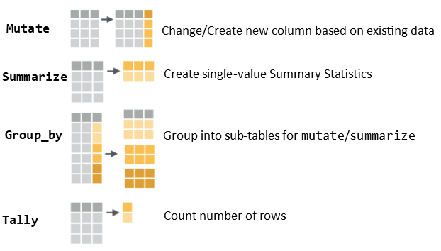

```{r setup, include=FALSE}
knitr::opts_chunk$set(echo = FALSE, warning=FALSE, message=FALSE)
library(tidyverse)
library(knitr)
library(nycflights13)
library(DT)
library(stargazer)
library(DiagrammeR)
```

## Processando dados - Uma Lista de Ações

Primeiro, ações que definem o escopo de nossos dados:


## Processing Data: Dados Originais

```{r, eval=FALSE, echo=TRUE}
flights
```

```{r, eval=TRUE}
flights %>% slice(1:5) %>% 
  select(carrier,origin,air_time,distance,dep_delay) %>% 
  datatable(options = list(dom = 't')) 
#mtcars %>% rownames_to_column() %>% slice(1:5) %>% datatable()

```

## Processando dados: Select

```{r, eval=FALSE, echo=TRUE}
flights %>% 
  select(air_time) 
```

```{r, eval=TRUE}
flights %>% slice(1:5) %>% 
  select(carrier,origin,air_time,distance,dep_delay) %>% 
  datatable(options = list(dom = 't')) %>% 
  formatStyle("air_time",backgroundColor="orange")
#mtcars %>% rownames_to_column() %>% slice(1:5) %>% datatable()

```

## Processando dados: Selecct

```{r, eval=FALSE, echo=TRUE}
flights %>% 
  select(air_time) 
```

```{r, eval=TRUE}
flights %>% slice(1:5) %>% 
  select(air_time) %>% 
  datatable(options = list(dom = 't'))
#mtcars %>% rownames_to_column() %>% slice(1:5) %>% datatable()

```


## Processando dados: Slice

```{r, eval=FALSE, echo=TRUE}
flights %>% 
  slice(1:2)
```

```{r, eval=TRUE}
flights %>% slice(1:5) %>% 
  select(carrier,origin,air_time,distance,dep_delay) %>% 
  datatable(options = list(dom = 't')) %>% 
  formatStyle("carrier",target="row",backgroundColor=styleEqual("UA","orange"))
#mtcars %>% rownames_to_column() %>% slice(1:5) %>% datatable()

```

## Processando dados: Slice

```{r, eval=FALSE, echo=TRUE}
flights %>% 
  slice(1:2)
```

```{r, eval=TRUE}
flights %>% slice(1:2) %>% 
  select(carrier,origin,air_time,distance,dep_delay)  %>% 
  datatable(options = list(dom = 't')) 
```


## Processando dados: Filter

```{r, eval=FALSE, echo=TRUE}
flights %>% 
  filter(origin=="JFK")
```

```{r, eval=TRUE}
flights %>% slice(1:5) %>% 
  select(carrier,origin,air_time,distance,dep_delay) %>% 
  datatable(options = list(dom = 't')) %>% 
  formatStyle("origin",target="row",backgroundColor=styleEqual("JFK","orange"))
```

## Processando dados: Filter

```{r, eval=FALSE, echo=TRUE}
flights %>% 
  filter(origin=="JFK")
```

```{r, eval=TRUE}
flights %>% slice(1:5) %>% 
  select(carrier,origin,air_time,distance,dep_delay) %>% 
  filter(origin=="JFK") %>% 
  datatable(options = list(dom = 't')) 
```


## Processando dados: Rename

```{r, eval=FALSE, echo=TRUE}
flights %>% 
  rename("airline"="carrier")
```

```{r, eval=TRUE}
flights %>% slice(1:5) %>% 
  select(carrier,origin,air_time,distance,dep_delay) %>% 
  datatable(options = list(dom = 't')) %>% 
  formatStyle("carrier",backgroundColor="orange")
```

## Processando dados: Rename

```{r, eval=FALSE, echo=TRUE}
flights %>% 
  rename("airline"="carrier")
```

```{r, eval=TRUE}
flights %>% slice(1:5) %>% 
  rename("airline"="carrier") %>%
  select(airline,origin,air_time,distance,dep_delay) %>% 
  datatable(options = list(dom = 't')) 
```

## Processando dados - Uma Lista de Ações

Segundo, ações para calcular a medida / estatística que precisamos



## Processing Data: Dados Originais

```{r, eval=FALSE, echo=TRUE}
flights
```

```{r, eval=TRUE}
flights %>% slice(1:5) %>% 
  select(carrier,origin,air_time,distance,dep_delay) %>% 
  datatable(options = list(dom = 't')) 
#mtcars %>% rownames_to_column() %>% slice(1:5) %>% datatable()

```

## Processando dados: Mutate

```{r, eval=FALSE, echo=TRUE}
flights %>% 
  mutate(air_time=round(air_time/60,3))
```

```{r, eval=TRUE}
flights %>% slice(1:5) %>% 
  select(carrier,origin,air_time,distance,dep_delay) %>% 
  datatable(options = list(dom = 't')) %>% 
  formatStyle("air_time",backgroundColor="orange")
```

## Processando dados: Mutate

```{r, eval=FALSE, echo=TRUE}
flights %>% 
  mutate(air_time=round(air_time/60,3))
```

```{r, eval=TRUE}
flights %>% slice(1:5) %>% 
  select(carrier,origin,air_time,distance,dep_delay) %>% 
  mutate(air_time=round(air_time/60,3)) %>% 
  datatable(options = list(dom = 't')) 
```

## Processando dados: Summarize

```{r, eval=FALSE, echo=TRUE}
flights %>% 
  summarize(avg_distance=mean(distance,na.rm=TRUE))
```

```{r, eval=TRUE}
flights %>% slice(1:5) %>% 
  select(carrier,origin,air_time,distance,dep_delay) %>% 
  datatable(options = list(dom = 't')) %>% 
  formatStyle("distance",backgroundColor="orange")
```

## Processando dados: Summarize

```{r, eval=FALSE, echo=TRUE}
flights %>% 
  summarize(avg_distance=mean(distance,na.rm=TRUE))
```

```{r, eval=TRUE}
flights %>% slice(1:5) %>% 
  select(carrier,origin,air_time,distance,dep_delay) %>% 
  summarize(avg_distance=mean(distance,na.rm=TRUE)) %>% 
  datatable(options = list(dom = 't')) 
```

## Processando dados: Tally

```{r, eval=FALSE, echo=TRUE}
flights %>% 
  tally()
```

```{r, eval=TRUE}
flights %>% 
  tally() %>% 
  datatable(options = list(dom = 't'))
```

## Processando dados: Group_by

```{r, eval=FALSE, echo=TRUE}
flights %>% 
  group_by(carrier) %>%
  summarize(avg_distance=mean(distance,na.rm=TRUE))
```

```{r, eval=TRUE}
flights %>% slice(1:5) %>% 
  select(carrier,origin,air_time,distance,dep_delay) %>% 
  datatable(options = list(dom = 't')) %>% 
  formatStyle("distance",backgroundColor="orange") %>% 
  formatStyle("carrier",backgroundColor="blue")
```

## Processando dados: Group_by

```{r, eval=FALSE, echo=TRUE}
flights %>% 
  group_by(carrier) %>%
  summarize(avg_distance=mean(distance,na.rm=TRUE))
```

```{r, eval=TRUE}
flights %>% slice(1:5) %>% 
  group_by(carrier) %>%
  select(carrier,origin,air_time,distance,dep_delay) %>% 
  summarize(avg_distance=mean(distance,na.rm=TRUE)) %>% 
  datatable(options = list(dom = 't')) 
```

