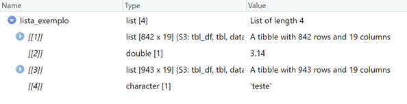

<style>
div.green { background-color:#e5f5e0; border-radius: 5px; padding: 20px;}
</style>

<style>
div.orange { background-color:#fee6ce; border-radius: 5px; padding: 20px;}
</style>

<style>
div.blue { background-color:#deebf7; border-radius: 5px; padding: 20px;}
</style>

<style>
div.purple { background-color:#9e9ac8; border-radius: 5px; padding: 20px;}
</style>


```{r setup, include=FALSE, echo=F}
knitr::opts_chunk$set(echo = T, eval=T, highlight=T)
library("nycflights13")
library("tidyverse")
library("rmarkdown")
library("knitr")
library("kableExtra")
library("broom")
filter <- dplyr::filter
```

# Introdução

Usar scripts de programação para a análise de dados tem várias vantagens: transparência, reprodutibilidade, etc. Mas uma vantagem fundamental é a capacidade para ganhar escala e para repetição das nossas análises várias vezes, sem repetir o código. A ideia é que podemos preparar uma análise para produzir uma estatística, uma tabela, um gráfico, um teste estatístico ou uma regressão para variáveis e valores específicos, e indicar para R refazer a análise várias vezes, deixando alguns elementos da análise fixos e permitindo a outros variarem. 

Por exemplo, imagine que nós queremos calcular a amplitude de uma variável: o máximo menos o mínimo. E queremos rodar a análise para três variáveis:

```{r, eval=F}
library("nycflights13")
library("tidyverse")

max_dep_delay <- flights %>% pull(dep_delay) %>% max(na.rm=T)
min_dep_delay <- flights %>% pull(dep_delay) %>% min(na.rm=T)
max_dep_delay - min_dep_delay

max_arr_delay <- flights %>% pull(arr_delay) %>% max(na.rm=T)
min_arr_delay <- flights %>% pull(arr_delay) %>% min(na.rm=T)
max_arr_delay - min_arr_delay

max_distance <- flights %>% pull(distance) %>% max(na.rm=T)
min_distance <- flights %>% pull(distance) %>% min(na.rm=T)
max_distance - min_arr_delay
```

Veja quanto do código aqui é repetido! Nove linhas e a única coisa que varia é o nome da variável... Não é simplesmente o esforço de digitação que é problemático aqui - mesmo que copiemos e colemos, temos que lembrar quais elementos precisamos atualizar. Se esquecermos apenas uma mudança, a nossa análise estará errada. Isso é responsável por uma grande parcela de erros na análise de dados. Vocês já identificaram o erro no código acima??

# Funções Customizadas

O uso de repetição exige uma separação clara dos dois elementos fundamentais de programação em R: **Objetos** (tibbles, vetores, valores únicos), e **Funções** (ações que recebem insumos e geram produtos). Com repetição, normalmente fixamos as funções e ajustamos os objetos, para que os insumos às funções variem, e avaliamos a variação nos produtos finais. A função só precisa ser escrita uma vez, evitando a repetição manual do cálculo.

Podemos gerar uma função que aceita um vetor (uma coluna de nosso tibble), e encaminhar várias colunas para a nossa função. (Revise a introdução a funções em [Tutorial 4](https://jonnyphillips.github.io/Ciencia_de_Dados/Estatisticas_Resumidas.html) se ajudar). Com o exemplo de calcular amplitude:

```{r, echo=F}
amplitude <- function(x) {
  resultado <- max(x, na.rm=T) - min(x, na.rm=T)
  return(resultado)
}
```


```{r, eval=F}
amplitude <- function(x) {
  resultado <- max(x, na.rm=T) - min(x, na.rm=T)
  return(resultado)
}

flights %>% pull(dep_delay) %>% amplitude()
flights %>% pull(arr_delay) %>% amplitude()
flights %>% pull(distance) %>% amplitude()
```

O código aqui gera uma nova função chamada `amplitude` que recebe um vetor (o `x`). Dentro dos chaves (`{`, `}`) colocamos o nosso cálculo de amplitude - o máximo do vetor `x` menos o mínimo de `x` que salvamos como objeto `resultado`. E finalmente indicamos para a função devolver o valor de `resultado` como o produto da função. Assim, `amplitude` fica disponível como qualquer outra função de R para aplicaçõ às variáveis de interesse. 

O uso da função já acelera bastante a análise! E também deixa fácil ajustar o cálculo no futuro. Por exemplo, para arredondar os resultados, é só incorporar uma vez na função, e vai afetar todos os cálculos seguintes:

```{r, eval=F}
amplitude <- function(x) {
  resultado <- max(x, na.rm=T) - min(x, na.rm=T)
  return(round(resultado, 0))
}

flights %>% pull(dep_delay) %>% amplitude()
flights %>% pull(arr_delay) %>% amplitude()
flights %>% pull(distance) %>% amplitude()
```

# Repetindo a aplicação de funções (`map`, `map_df`)

A parte chata do código acima é que não economizamos tantas linhas de código - temos 6 linhas - e ainda precisamos repetir as linhas finais para aplicar a função à cada variável, abrindo oportunidades para erros. 

É possível automatizar a *aplicação* da função? Sim! A função `map` é bem flexível e permite a aplicação de uma função à uma série de objetos. Os objetos podem ser listas - vamos ver exemplos disso em breve - ou vetores, por exemplo as colunas do nosso tibble. O argumento de `map` é o nome da função que queremos aplicar.

Em nosso exemplo de amplitude, podemos `select` as colunas para as quais queremos calcular a amplitude, e `map` a função amplitude para cada coluna:

```{r, eval=F}
amplitude <- function(x) {
  resultado <- max(x, na.rm=T) - min(x, na.rm=T)
  return(resultado)
}
flights %>% select(dep_delay, arr_delay, distance) %>% 
  map(amplitude)

```

Muito mais simples! Agora em mais ou menos quatro linhas. E note o quanto é fácil ampliar a análise para mais variáveis - é só incluí-las dentro de `select`:

```{r, eval=T}
flights %>% select(dep_delay, arr_delay, distance, air_time) %>% 
  map(amplitude)
```

Qual o formato do resultado de `map`? Inspecione ele com `class()`. É uma lista, um formato genérico e flexível que vamos discutir em breve, mas em geral nesse curso sempre preferimos trabalhar com tibbles. Felizmente, existe uma variedade de `map` que padroniza o resultado da aplicação repetida da função para um tibble, `map_df`:

```{r, eval=F}
flights %>% select(dep_delay, arr_delay, distance, air_time) %>% 
  map_df(amplitude)
```

```{r, echo=F}
flights %>% select(dep_delay, arr_delay, distance, air_time) %>% 
  map_df(amplitude) %>%
  kable()
```

# Repetindo a aplicação de funções para vetores fora de um tibble

Observe que a funcionalidade aqui é bem parecida de `summarize(across())` do Tutorial 4, permitindo a aplicação de uma função à várias colunas. É verdade, mas o ganho de `map` é que ela é mais geral e pode ser usada fora do contexto de `mutate` e `summarize`, e fora de um tibble único. Por exemplo, imagine que temos um vetor de centenas de arquivos .csv para abrir em R na pasta do nosso projeto - `map` permite aplicar a função de `read_csv` para *todos* os arquivos em uma linha só (gerando dois arquivos de csv primeiramente para ilustrar):

```{r}
flights %>% filter(month==1 & day==1) %>% write_csv("flights_jan_01.csv")
flights %>% filter(month==1 & day==2) %>% write_csv("flights_jan_02.csv")

arquivos <- c("flights_jan_01.csv", "flights_jan_02.csv")

dados <- arquivos %>% map(read_csv)
```

A repetição ('iteração') aqui não é sobre múltiplas colunas, mas sobre cada elemento do vetor 'arquivos'. O resultado 'dados' é uma lista. Dentro da lista existem, separadamente, dois tibbles. Para rastrear as diferenças entre os elementos da lista é sempre uma boa ideia nomear os elementos - realizamos isso com a função `set_names()` antes de uso de `map`:

```{r}
dados <- arquivos %>% set_names() %>% 
  map(read_csv)
```

Temos duas opções para juntar os dois tibbles em um tibble. Podemos substituir `map_df` para `map`, como já aprendemos acima. Ou podemos manter `map` e seguir com `bind_rows()` que junta tibbles verticalmente:

```{r}
dados <- arquivos %>% map_df(read_csv)

dados <- arquivos %>% map(read_csv) %>%
  bind_rows()
```

# Repetindo a aplicação de funções para uma lista

Até agora, utilizamos `map` para transformar um vetor (fora de um tibble como vetor mesmo, ou como uma coluna dentro de um tibble) em uma lista ou um tibble. Existe mais uma combinação possível - usar uma lista como o *insumo* de `map`. O grande valor aqui é quando queremos trabalhar com **múltiplos tibbles**. 

`map` funciona com vetores ou listas, aplicando a função a cada elemento do vetor/lista. Listas são úteis porque eles podem conter uma variedade de outros objetos - valores únicos, vetores, tibbles, outra listas. Se tivermos vários tibbles - por exemplo bancos de dados de anos distintos - podemos organizar eles em uma lista. 

<div class = "blue">

**Habilidade Básica de Programação: Listas**

Uma lista é um conjunto de objetos diversos organizados verticalmente. Não é um tibble com linhas e colunas, listas só têm 'elementos', caixas vazias para guardar qualquer tipo de objeto - valores únicos, tibbles ou outras listas. Vetores também são objetos unidimensionais, mas diferem de listas porque vetores apenas contém objetos simples - valores únicos - e de um único tipo (numérico, caracter, lógico etc.). 

Em R, listas são fáceis de construir com `list(objeto1, objeto2, ...)`. Vamos ver como parece uma lista de uma mistura de objetos:

```{r, eval=T}
objeto1 <- flights %>% filter(month==1 & day==1)
objeto2 <- 3.14
objeto3 <- flights %>% filter(month==1 & day==2)
objeto4 <- "teste"

lista_exemplo <- list(objeto1, objeto2, objeto3, objeto4)
lista_exemplo
```

Se você abre o objeto `lista_exemplo` no seu Environment, vai aparecer assim, deixando claro os quatro elementos de vários tipos:



Se rodar o código `lista_exemplo` no Console, o R vai mostrar o seu conteúdo com quatro elementos, designado com o sintaxe: `[[1]]`, `[[2]]` etc. Os colchetes duplos indicam um elemento de uma lista. 

Para acessar um elemento único de uma lista, é só indicar qual elemento deseja com os colchetes:

```{r, eval=F}
lista_exemplo[[1]]
```

Também podemos nomear os elementos de uma lista para guardar eles mais sistematicamente:

```{r, eval=F}
lista_exemplo_nomes <- list(tibble1=objeto1, 
                      numero=objeto2, 
                      tibble2=objeto3, 
                      string=objeto4)

lista_exemplo_nomes

lista_exemplo_nomes[["string"]]
```

Note que as ações do tidyverse (`select`, `filter`, `slice` etc.) não funcionam com listas. Temos que trabalhar com as ferramentas básicas de R, ou aplicar funções com `map` como ilustrado neste tutorial.

</div>

<br>

Para entender o uso de `map` com listas, e especificamente com diversos tibbles, vamos separar o banco de dados de `flights` em dois meses, organizar eles em uma lista (com a função `list()`), e aplicar uma função a cada banco (cada tibble). Como exemplo, vamos calcular o atraso médiao por aeroporto com `summarize()`. 

```{r, eval=T}
flights_jan <- flights %>% filter(month==1)
flights_fev <- flights %>% filter(month==2)

flights_jan_fev <- list(janeiro=flights_jan, 
                        fevereiro=flights_fev)

flights_jan_fev %>% map(summarize, dep_delay=mean(dep_delay, na.rm=T))
```

Fácil, sim? Não tem tanta diferença entre `list()`, criando uma lista, e `c()`, criando um vetor: a diferença é simplesmente que cada elemento de `c()` tem que ser um valor único, enquanto `list()` é mais flexível, aceitando qualquer tipo e tamanho de objeto, incluindo tibbles. 

As listas também facilitam a aplicação de nomes aos elementos, que torna mais intuitivo o acesso aos elementos no futuro, e de forma automatizada com outras funções. 

O resultado seria ainda mais claro e acessível se forçamos a produção de um tibble em vez de uma lista:

```{r, eval=T}
flights_jan_fev %>% map_df(summarize, dep_delay=mean(dep_delay, na.rm=T))
```

Há apenas um problema com o resultado aqui - não sabemos qual valor descreve qual mês! É importante manter a identificação dos nossos resultados, e seria útil ter uma coluna com o nome do mês dentro do tibble. Isso é possível a partir dos nomes dos elementos da lista (os tibbles) que contém os detalhes de cada mês. Apenas especificamos um argumento adicional em `map_df`: o nome da nova coluna no argumento `.id="nome_de_coluna"`.

```{r, eval=T}
flights_jan_fev %>% map_df(summarize, dep_delay=mean(dep_delay, na.rm=T),
                           .id="Mês")
```

Agora, vale a pena resumir os usos de `map`, porque estamos trabalhando num nível mais abstrato e mais flexível, com uma variedade grande de opções:

```{r, echo=F}
tibble(Função=c('map', 'map', 'map', 'map_df', 'map_df', 'map_df'),
       Insumo=c("Múltiplas Colunas de um Tibble (com select)","Um Vetor", "Uma Lista",
                "Múltiplas Colunas de um Tibble (com select)","Um Vetor", "Uma Lista"),
       Produto=c("Lista","Lista", "Lista", "Tibble", "Tibble", "Tibble")) %>%
  kable(caption="Usos possíveis de `map`")
```

Tanta flexibilidade exige cuidado por nosso lado - temos que entender bem qual é o tipo de objeto que contém os itens sobre os quais queremos repetir a função, e qual é o produto desejado.

A família de funções de `map` ajuda bastante na repetição porque elas automatizam o processo de substituição de cada insumo na função, e a organização do resultado. Porém, é uma família nova, e historicamente a repetição foi realizada com uma ferramenta mais manual, o '`for` loop'. Recomendamos trabalhar com `map` quando possível para simplicidade, mas é útil e pedagogicamente interessante entender os `for` loops, então incluímos uma introdução rápida na caixa abaixo. 

<div class = "blue">

**Habilidade Básica de Programação: For Loops**

Uma forma alternativa para repetir ações em R é o uso de 'for' loops. Eles são muito comuns em programação, então é bom conhecer. Mas se você conseguir usar `map`, normalmente é mais eficiente. 

Um `for` loop literalmente repete uma ação várias vezes, substituindo um valor novo cada vez. Há quatro elementos num 'for' loop:

1. **A função para repetir** - `flights %>% pull(i) %>% amplitude()`. o `i` significa o valor/a variável que queremos ajustar cada iteração.
2. **Uma definição num vetor dos valores para substituir na função no lugar de 'i'** - `elementos <- c("dep_delay", "arr_delay", "distance")`. 
3. **A definição do loop mesmo** - `for (i in elementos) { }`. Isso significa que a função dentro das chaves se repete para cada valor do vetor `elementos`, cada vez substituindo o `i` na função pelo valor correspondente de `elementos`. 
4. **Um objeto final para guardar os resultados** - Dado que vamos repetir a função várias vezes, precisamos de um objeto que aceita múltiplos valores, ou seja, um vetor. Podemos criar anteriormente um vetor vazio com `resultado <- c()`, e dentro da função salva a amplitude calculada com nome do elemento atual `i`. 

```{r, eval=T}
elementos <- c("dep_delay", "arr_delay", "distance")

resultado <- c()

for (i in elementos) {
  resultado[i] <- flights %>% pull(i) %>% amplitude()
}
```

```{r, echo=F}
resultado
```


Veja de novo a lógica do 'for' loop: a linha da função contém duas instâncias de 'i': o índice do destino no resultado e a variável para analisar dentro de `pull()`. A questão é simplesmente quais variáveis para substituir para 'i'. Elas são definidas pela linha anterior: `i in elementos` - todas as variáveis definidas no vetor 'elementos' .

</div>

<aside>

Mais uma alternativa: Se você não saiba o número de repetições necessárias, pode repetir até que uma condição seja atendida com um `while` loop, por exemplo:

```{r, eval=F}
while (condição) {
 ...
}
```

</aside>

<br>

## Exercício 1: Repetição

<div class = "green">


1. Gere três tibbles separados derivados do banco de dados `flights`, um para cada aeroporto de origem (`origin`). Em seguida, coloque os três tibbles em uma lista única (`list()`), com o nome de cada elemento da lista a sigla do aeroporto. 

```{r, eval=F, echo=F, tidy=TRUE, code_folding="Mostrar Código"}
EWR <- flights %>% filter(origin=="EWR")
JFK <- flights %>% filter(origin=="JFK")
LGA <- flights %>% filter(origin=="LGA")

flights_por_origem <- list(EWR=EWR,
                           JFK=JFK,
                           LGA=LGA)

#Ou, mais eficiente: flights_por_origem <- flights %>% split(.$origin)
```


2. Use `map` para calcular o número de observações (voos) em cada tibble usando a função `nrow`.

```{r, eval=F, echo=F, tidy=TRUE, code_folding="Mostrar Código"}
flights_por_origem %>% map(nrow)
```

3. Filtre os três bancos de questão 1 para vôos com destino 'SFO' (San Francisco) usando `map`. Quantos voos (observações) têm cada aeroporto de Nova Iorque para SFO?

```{r, eval=F, echo=F, tidy=TRUE, code_folding="Mostrar Código"}
flights_por_origem %>% map(filter, dest=="SFO") %>% 
  map(nrow)
```

4. Para cada um dos três bancos de dados de questão 1, calcule a velocidade de cada voo usando `map`.

```{r, eval=F, echo=F, tidy=TRUE, code_folding="Mostrar Código"}
flights_por_origem <- flights_por_origem %>% 
  map(mutate, velocidade=distance/air_time)
```

5. Baseado no seu resultado da questão 4, resuma cada um dos três bancos para calcular a média da velocidade dos voos usando uma função da família `map`. O resultado deve ser um tibble com todos os detalhes apropriados.

```{r, eval=F, echo=F, tidy=TRUE, code_folding="Mostrar Código"}
flights_por_origem %>% map_df(summarize, dep_delay=mean(velocidade, na.rm=T),
                              .id="Aeroporto")
```

</div>

# Gerando Novas Colunas com `map` e `mutate`

Todas as aplicações de `map` acima produzem *novos* tibbles ou listas. Mas quando os resultados da aplicação da função cabem no tibble original - por exemplo, cada linha do tibble é um estado e temos um resultado por cada estado - é desejável manter os resultados dentro do tibble original, e apenas adicionar mais uma coluna. 

Neste caso, uma forma muito útil de usar `map` é *dentro* de `mutate`. Isso permite inserir os resultados do cálculo repetido em uma nova coluna em nosso tibble. Veja uma forma interessante de abrir os arquivos .csv - podemos gerar um tibble com a primeira coluna documentando os *nomes dos arquivos*, e depois usar `map` conjunto com `read_csv` para inserir os *dados* de cada arquivo em uma nova coluna. O nosso tibble agora é mais parecido com um armário de arquivos, com cada gaveta bem marcada.  

Note que agora temos que indicar para `map` para qual coluna queremos aplicar a função `read_csv` - a ordem é `map(coluna, função)`. Cada linha reflete um arquivo, e os dados - literalmente os tibbles - ficam 'nested' numa lista-coluna (como descobrimos no tutorial 7).

```{r, echo=F}
dados_nested <- tibble(dia=c(1, 2),
                       file=c("flights_jan_01.csv", 
                              "flights_jan_02.csv")) %>% 
  mutate(conteudo=map(file, read_csv))
```

```{r, eval=T}
dados_nested <- tibble(dia=c(1, 2),
                       file=c("flights_jan_01.csv", 
                              "flights_jan_02.csv")) %>% 
  mutate(conteudo=map(file, read_csv))

dados_nested
```

Este procedimento pode ajudar a organizar bases de dados grandes, pois podemos trabalhar com uma tabela simples de resumo, e não múltiplas tabelas inteiras. 

## Repetindo Funções com Tibbles Nested

Qual é a classe da coluna de '`conteudo`' no tibble `dados_nested`? É uma lista, uma lista de tibbles. Então o nosso fluxo de análise não precisa parar aqui. Podemos continuar usando `map` para aplicar uma função para cada tibble separadamente. 

Por exemplo, vamos adicionar uma nova coluna no tibble de resumo com o número de voos (o número de observações) em cada banco/linha.

```{r}
dados_nested <- dados_nested %>% 
  mutate(num_voos=map(conteudo, nrow))
```

Pare, Como aparece `dados_nested` agora? Na coluna `num_voos` temos uma coisa estranha `<int [1]>` - isso significa que existe um número dentro da lista, mas não está sendo apresentado. Isso acontece porque `map` produz uma lista-coluna por padrão. É melhor usar uma variedade de `map` para resultados que são valores únicos numéricos: `map_dbl` (de 'double', o tipo de variável numérica).

```{r}
dados_nested <- dados_nested %>% 
  mutate(num_voos=map_dbl(conteudo, nrow))
```

Bem melhor - agora podemos ver o número de linhas diretamente em nossa tabela. Também é possível aplicar uma função customizada para cada banco. Por exemplo, se quisermos resumir a correlação entre `dep_delay` e `dep_time` para cada banco, é só escrever uma função que executa esse cálculo para um tibble genérico, e aplicar a função dentro de `map` para a coluna apropriada:

```{r}
corr_function <- function(tibble) {
  tibble %>% cor.test(~ dep_delay + dep_time, data=.) %>%
    tidy()
}

dados_nested <- dados_nested %>% 
  mutate(corr=map(conteudo, corr_function))
```

Agora temos todos os resultados do teste de correlação na coluna `corr`. Para deixar apenas a estimativa central de correlação visível, podemos adaptar a função para extrair o valor específico desejado.

```{r}
corr_function <- function(tibble) {
  tibble %>% cor.test(~ dep_delay + dep_time, data=.) %>%
    tidy() %>%
    pull(estimate)
}

dados_nested <- dados_nested %>% 
  mutate(corr=map_dbl(conteudo, corr_function))
```

## Repetindo Análises

É comum em análises empíricas executar várias estimativas. Por exemplo, com regressões podemos ajustar o banco de dados para estimar resultados em amostras diversas. Vamos usar este exemplo para aprender como executar múltiplas regressões em uma única linha de código.

Começamos com uma regressão simples:

```{r}
flights %>% lm(dep_delay ~ dep_time, data=.)
```

A nossa primeira tarefa é repetir a regressão para vários bancos de dados. Vamos aproveitar da nossa tabela `dados_nested`. Inserindo a regressão `lm` dentro de `map` e `mutate` aplica a regressão para o banco de dados em cada linha (na coluna 'conteudo'), e guarda os resultados em uma nova coluna. 

Porém, em vez de especificar uma função customizada para aplicação com `map`, vamos gerar a função de regressão 'na hora' ('anonimamente') diretamente dentro de `map` com o uso de til `~` antes da função. É apenas um atalho para facilitar; claro que fica melhor definir uma função explícita anteriormente para cálculos mais complexos.

```{r}
dados_nested <- dados_nested %>% 
  mutate(regressão=map(conteudo, ~lm(dep_delay ~ dep_time, data=.)))
```

Agora temos o resultado básico da regressão em nosso tibble. Provavelmente queremos limpar isso para tornar o resultado principal mais acessível. Por exemplo, podemos aplicar `tidy` com mais uma chamada de `mutate` e `map` para gerar um tibble dos resultados:

```{r}
dados_nested <- dados_nested %>% 
  mutate(regressão=map(regressão, tidy))
```

E se quisermos extrair um coeficiente de interesse para o tibble de resumo:

```{r}
dados_nested <- dados_nested %>% 
  mutate(coef=map(regressão, filter, term=="dep_time"),
         coef=map_dbl(coef, pull, estimate))
```

Observe um ponto importante aqui - quando aplicamos uma função com `map` sem o uso de `~`, os argumentos adicionais à função não ficam em parênteses, mas depois de uma vírgula.

Na situação em que começamos com um banco de dados inteiro e queremos aplicar uma regressão por grupo, em que o grupo é definido por uma variável, é só usar `group_by` e `nest` para preparar o tibble apropriado. Por exemplo, aplicando regressões distintas por aeroporto de origem:

```{r}
flights_reg_por_origem <- flights %>% 
  group_by(origin) %>%
  nest() %>%
  mutate(regressão=map(data, ~lm(dep_delay ~ dep_time, data=.)),
         regressão=map(regressão, tidy),
         coef=map(regressão, filter, term=="dep_time"),
         coef=map_dbl(coef, pull,estimate))
```

Preparando, executando, e resumindo três regressões em uma única linha de código., parabéns!

### Mapeando argumentos múltiplos

Não é apenas o banco de dados que é possível ajustar numa regressão - o `lm` aceita vários argumentos: 'data', mas também 'formula', o modelo da regressão. Isso é comum - funções aceitam vários argumentos e às vezes queremos variar mais que um argumento ao longo da nossa repetição. Por exemplo, eu queria rodar modelos A e B para banco de dados X e Y, modelo C para banco de dados Y e Z, e modelo D para banco de dados Z. 

Operações desta forma exigem que indiquemos para `map` *duas* colunas para encaminhar a nossa função, uma para cada argumento. É simples: verificamos que as duas colunas desejadas existem no tibble, usamos `map2` em vez de `map`, e indicamos os nomes das duas colunas no `map2`, no ordem em que eles são esperados pela função que vamos aplicar.

```{r}
dados_nested <- dados_nested %>% mutate(formula=c("dep_delay ~ dep_time",
                                  "arr_delay ~ dep_time"))

dados_nested <- dados_nested %>% mutate(resultados=map2(formula, conteudo, lm))
```

Agora, os dois resultados refletem ambos uma amostra (banco de dados) e uma fórmula diferente para cada linha do tibble original (cada aeroporto de origem).

Com as funções de tidyverse básico e a família de `map`, agora você consegue executar quase qualquer tarefa de análise de dados - são um conjunto de ferramentas muito poderoso. As possibilidades são infinitas- para mais informação e operações mais complexas, veja [o cheatsheet aqui](https://github.com/rstudio/cheatsheets/blob/master/purrr.pdf).

## Exercício 2: Programação Funcional

<div class = "green">

1. Gere um tibble 'nested' com uma linha para cada mês usando o banco de dados `weather`.

```{r, eval=F, echo=F, tidy=TRUE, code_folding="Mostrar Código"}
weather_month <- weather %>% group_by(month) %>% nest()
```

2. Adicione uma coluna ao tibble gerado em questão 1 que mostra o número de observações em cada mês.

```{r, eval=F, echo=F, tidy=TRUE, code_folding="Mostrar Código"}
weather_month <- weather_month %>% mutate(obs=map_dbl(data, nrow))
```

3. Usando o seu banco de dados nested de questão 2, execute uma regressão para cada mês separadamente, com 'precip' (chuva) na variável dependente e 'temp' (temperatura) na variável independente na fórmula. Salve o coeficiente da variável temperatura numa coluna nova.

```{r, eval=F, echo=F, tidy=TRUE, code_folding="Mostrar Código"}
weather_month %>% mutate(regressão=map(data, ~lm(precip ~ temp, data=.)),
                         coef=map(regressão, tidy),
                         coef=map(coef, filter, term=="temp"),
                         coef=map_dbl(coef, pull, estimate))
```

4. Separe a coluna de temperatura de cada mês em uma nova coluna nested como um vetor para cada mês, e aplique um teste shapiro (veja tutorial 9, `shapiro.test`) de normalidade para a temperatura de cada mês, processando o resultado para que o valor 'p' seja visível no tibble de resumo por mês.

```{r, eval=F, echo=F, tidy=TRUE, code_folding="Mostrar Código"}
weather_month <- weather_month %>% 
  mutate(temp=map(data, pull, temp),
         normal_temp=map(temp, shapiro.test),
         normal_temp=map(normal_temp, tidy),
         normal_temp=map_dbl(normal_temp, pull, p.value))
```

</div>

<br>

# Leitura para Tutorial 12

<div class = "orange">

Antes da próxima aula, por favor leia [R 4 Data Science, Capítulo 14 sobre Strings](https://r4ds.had.co.nz/vectors.html) e [Tidy Text Mining Capítulo 1](https://www.tidytextmining.com/tidytext.html)

</div>